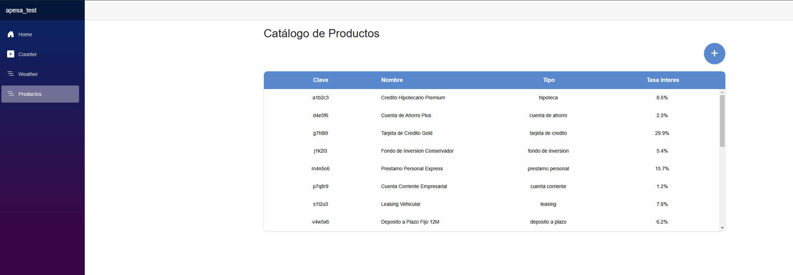
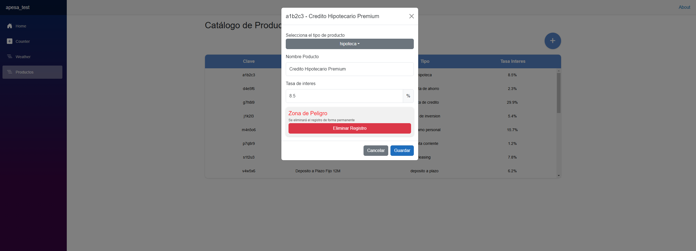

# 📌 Blazor Financial Products CRUD

Este proyecto es una aplicación Blazor que incorpora una nueva vista para la gestión de productos financieros.

## 🚀 Características

* CRUD de productos financieros (Crear, Leer, Actualizar, Eliminar)
* Interfaz moderna
* Uso de Entity Framework para la persistencia de datos

## 🛠️ Tecnologías

* Blazor Server/WebAssembly
* .NET 6+
* Entity Framework Core

## 📦 Instalación

1. Clona el repositorio:
   ```sh
   git clone https://github.com/RicardoZapata22/apesa_test_razor.git
   ```
2. Navega al directorio del proyecto:
   ```sh
   cd repo-blazor-crud
   ```
3. Restaura las dependencias:
   ```sh
   dotnet restore
   ```
4. Configura la cadena de conexión en `appsettings.json`.
5. Aplica las migraciones de la base de datos:
   ```sh
   dotnet ef database update
   ```
6. Ejecuta la aplicación:
   ```sh
   dotnet run
   ```

## 📷 Vista previa





🤝 Contribución

Las contribuciones son bienvenidas. Si deseas mejorar este proyecto, abre un issue o un pull request.

---

📝 **Licencia:** MIT 📜 | 💻 **Autor:**[Ricardo Zapata](https://github.com/RicardoZapata22)
